# **Realizacija sistema za dodavanje i uklanjanje šuma iz signala**

## 1.  Uvod

Projekat se sastoji iz 3 odvojena zadatka:

1.  Dodavanje šuma na ulazni signal

2.  Prepoznavanje frekvencije šuma na ulaznom signalu

3.  Uklanjanje šuma sa ulaznog signala

Za potrebe zadatka koristi se razvojna ploča Texas Instruments TMS320C5535 eZdsp.

Na ploči se nalaze:

- TMS320C5535 procesor

- XDS100 emulator

- Flash memorija kapaciteta 8 MB

- TLV320AIC3204 programabilni audio kodek

- USB 2.0 port

- Micro SD card slot

- Linijski 3.5mm audio ulazni i izlazni port

- 60-pinski prolaz zapovezivanj eproširenja

- OLED disple jrezolucije 96 x 16 piksela

- 2 dugmeta

- 4 led diode

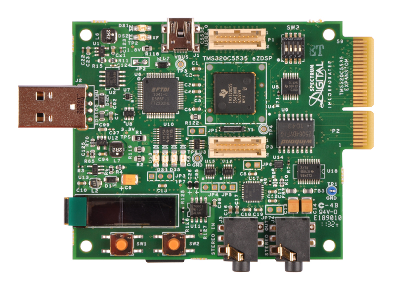  
Slika 1: TMS320C5535 eZdsp

Za potrebe zadatka potrebno je koristiti 2 ploče. Ulaz na prvoj ploči je
signal koji se dovodi sa računara ili nekog drugog uređaja sposobnog da
reprodukuje zvuk. Izlaz je dati signal sa dodatim šumom izabrane
frekvencije. Ulaz na drugu ploču je izlaz sa prve ploče, dok je izlaz
signal sa otklonjenim šumom, koji bi trebao biti isti kao i ulazni.
Podržane frekvencije, veličine bafera, kao i prozorska funkcija koju
treba koristiti dati su u tabeli 1.

  ----------     ---------- ---------- ---------- ------------- -------------- ------------------------
  | **f1** | **f2** | **f3** | **f4** | **LT vel.** | **FFT size** | **Prozorska funkcija** |
  | -------- | -------- | -------- | -------- | ----------- | ------------ | ---------------------- |
  | 1200     | 1650     | 2400     | 2850     | 1025        | 128          | Hann                   |
Tabela 1: Zadate vrednosti

## 2. Dodavanje šuma na ulazni signal

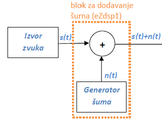  
Slika 2: Blok za dodavanje šuma u sistem

Za generisanje sinusa koristi se tablica sinusa. Ova tablica u sebi
sadrži vrednosti sinusa u prvom kvadrantu. Vrednosti za ostale kvadrante
dobijaju se prostim prebacivanjem, po sledećim formulama.

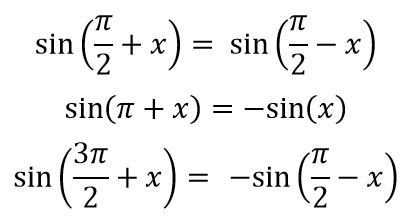  
Slika 3: Prebacivanje u prvi kvadrant

Generisane vrednosti predstavljene su celobrojnom 16-bitom vrednosti,
koja je skalirana na opseg \[-1, 1\]. Kao dodatni argumenti šalju se
frekvencija i amplituda. Kako je moguće generisati 4 šuma različitih
frekvencija, potrebno je i omogućiti način da se željena frekvencija
izabere. Za to se koristi dugme SW1, pritiskom na koje se prelazi na
sledeću frekvenciju. Takođe se trenutna frekvencija ispisuje na ekranu
ploče.

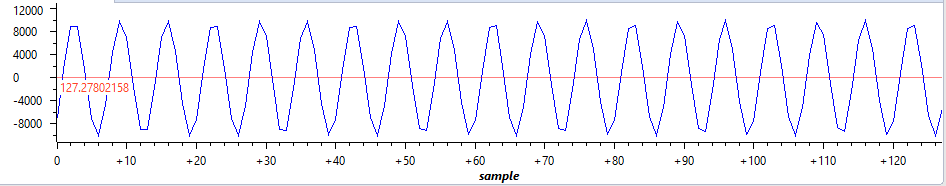  
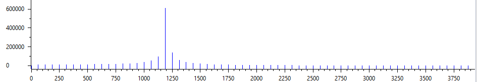  
Slika 4: Šum za 1200 Hz  

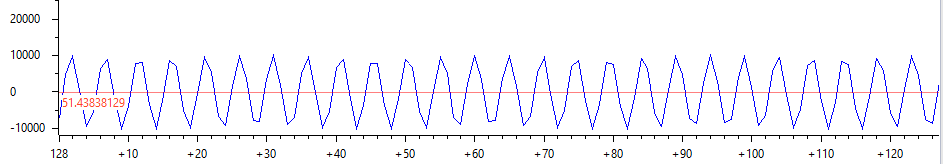  
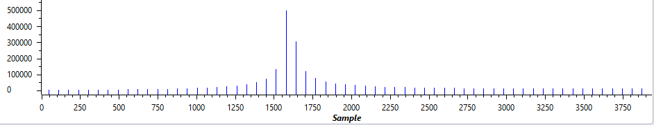  
Slika 5: Šum za 1650Hz  

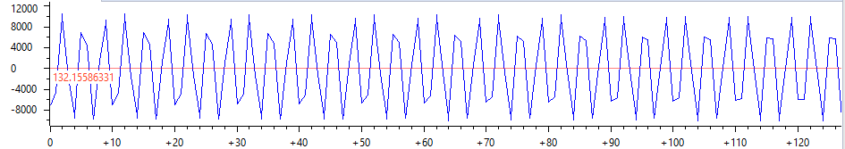  
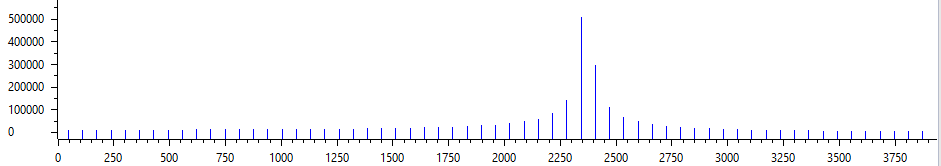  
Slika 6: Šum za 2400Hz  

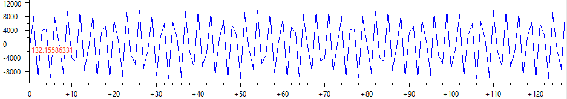  
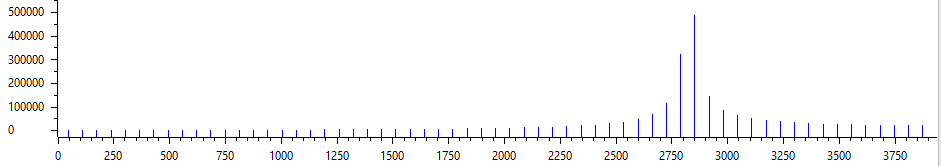  
Slika 7: Šum za 2850Hz  

## 3.Prepoznavanje šuma

Prepoznavanje šuma vrši se tako što se
ulazni signal prozorira, nakon čega se odradi Diskretna Furijeova
transformacija. Nakon toga računa se aplitudski spektar signala i
pronaći maksimalni koeficijent k u dobijenom nizu. Nakon pronalaženja,
dobijeni broj se poredi sa već poznatim brojevima 4 zadatih frekvencija.

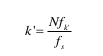  
Slika 8: Formula za izračunavanje maksimalnog koeficijenta frekvencije

# 3.  Uklanjanje šuma
    
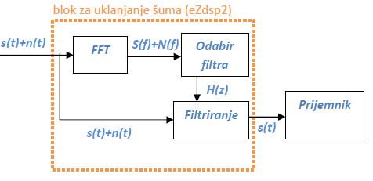  
Slika 9: Blok za dodavanje šuma u sistem

Za uklanjaje šuma koristi se notch filter. Ovaj filter sledeći oblik:

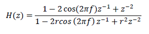

Parametar r predstavlja razdaljinu između polova i nula, čime utiče na
širinu propusnog opsega. Što je on bliži broju 1, to je i propusni
filter uži. Ovo važi pod pretpostavkom da je amplituda šuma dominantna u
datom signalu, što uglavnom i jeste slučaj.

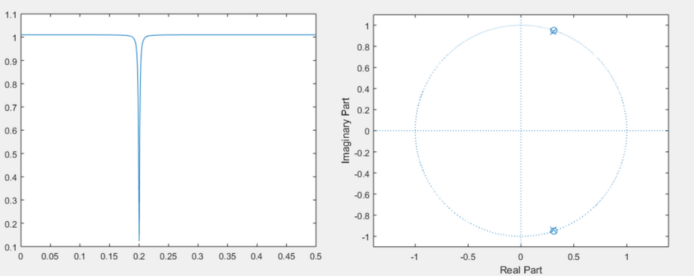
Slika 10: Prenosna karakteristika i raspored nula i polova za notch
filter (f=0.2, r=0.99)

Pošto smo u prethodnom delu prepoznali o kojoj je frekvenciji reč, sada
je samo potrebno na ulazni signal primenti odgovarajuće koeficijente,
kako bi se otklonila željena frekvencija.

## 4. Spajanje sistema u celinu

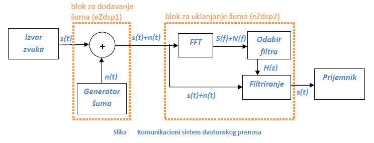  
Slika 11: Sistem kao celina

Oba dela sistema možemo zasebno testirati povezivanjem na računar,
reprodukcijom odgovarajućeg ulaza i snimanjem dobijenog izlaza. Primer
ovoga dat je na slici 10. Prilikom testiranja korišćen je snimak muškog
glasa na koji su naizmenično dodavane zadate frekvencije.

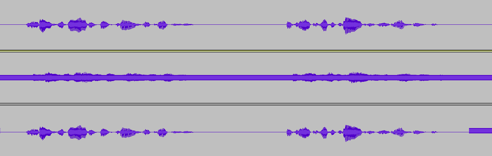  
Slika 12: Početni signal, signal sa šumom i signal nakon otklanjanja
šuma (od gore ka dole)
